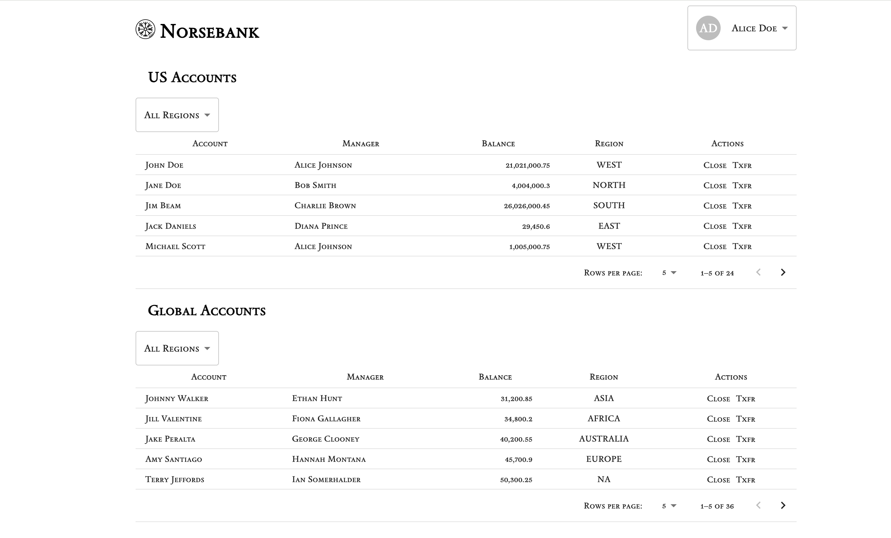
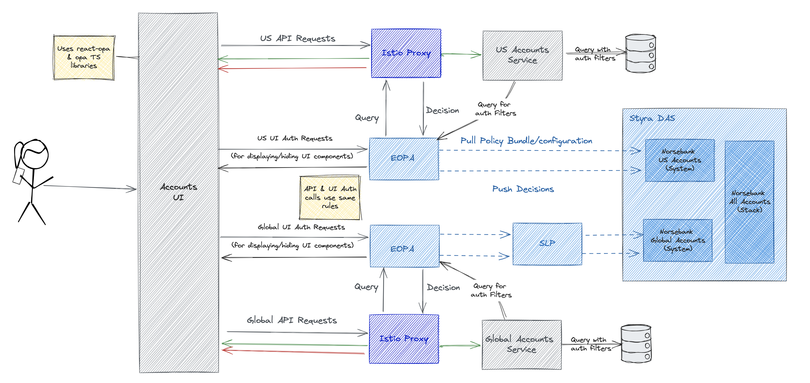

# Norsebank Accounts Demo App

This repository contains the Norsebank Accounts Demo application, a comprehensive showcase of [Styra DAS](http://styra.com)'s & (E)OPA's policy-driven security capabilities. The demo includes both backend (Java) and frontend (ReactJS) components, demonstrating how to write a single policy that can protect both frontend ReactJS code and backend APIs, reducing maintenance costs and eliminating duplicated effort.

The provided policies exemplify various access control models, including Role-Based Access Control (RBAC), Attribute-Based Access Control (ABAC), Relationship-Based Access Control (ReBAC), and Policy-Based Access Control (PBAC). By exploring these policies, you can gain insights into how to effectively secure your applications with Styra DAS and OPA.

The project include terraform scripts that will fully build the Systems in Styra DAS and deploy all the necessary services into a Kubernetes cluster, so that you have a fully functional demostration enviornment.

## Prerequisites
- An existing Kubernetes cluster with Istio enabled & [Gateway CRDs](https://gateway-api.sigs.k8s.io/guides/#getting-started-with-gateway-api) installed
- kubectl configured to interact with your Kubernetes cluster
- Terraform installed on your local machine
- A Styra DAS instance with an [API token](https://docs.styra.com/das/administration/token-management/create-api-token) created

## Setting Up a Local Minikube Cluster

If you don't have a Kubernetes cluster available, you can set up a local Minikube cluster:

### 1. Install Minikube
Follow the instructions to install Minikube from the [official documentation](https://minikube.sigs.k8s.io/docs/start/).

### 2. Start Minikube with Istio
```bash
minikube start --cpus=4 --memory=8192 --addons=istio,istio-provisioner
```

### 3. Verify Minikube Installation
```bash
kubectl get pods -n istio-system
```

### 4. Install Gateway CRDs
This is one way to install the CRDs, the [k8s site](https://gateway-api.sigs.k8s.io/guides/#getting-started-with-gateway-api) has other methods as well
```bash
kubectl kustomize "github.com/kubernetes-sigs/gateway-api/config/crd?ref=v1.2.0" | kubectl apply -f -
```

## Setup Instructions

### 1. Clone the Repository
```bash
git clone https://github.com/kroekle/accounts-demo-app.git
cd accounts-demo-app
```

### 2. Configure Terraform
Navigate to the directory containing the Terraform scripts for setting up the demo app.

### 3. Initialize and Apply Terraform Scripts
```bash
cd terraform
terraform init
terraform apply
```
Make sure to provide the required variables (these can be set in a terraform.tfvars file).

  * bearer_token (DAS API token)
  * server_url (DAS tentant url e.g. https://TENANT.styra.com)
  * kube_config (default: ~/.kube/config)
  * kube_context (default: default)
  * eopa_license_key
  * application_host (default: accounts.norsebank.com)

#### 3.a Images used
The following images are used in this demo application:
   * *ghcr.io/styrainc/enterprise-opa:latest* (official EOPA image)
   * *styra/relay-client:latest* (official Styra Relay client, used for providing datasources to Styra DAS)
   * *ghcr.io/kroekle/accounts-demo-app/accounts-ui:latest* (demo, used ReactJS frontend)
   * *ghcr.io/kroekle/accounts-demo-app/accounts-service:latest* (demo, used for Java backend services, an environment variable is set to distinguish between US and Global)
   * *ghcr.io/kroekle/accounts-demo-app/state-service:latest* (demo, very basic Go service that provides storeage for UI swtiches used in PBAC example) 

(all the demo images are built from source in this repository)

If you cannot use the images directly from the repositories that they are saved in, then you can override the base paths with the following variables:

   * *epoa_base_image_location* (default: ghcr.io/styrainc)
   * *relay_base_image_location* (default: styra)
   * *demo_svc_base_image_location* (default: ghcr.io/kroekle/accounts-demo-app)
   
### 4. Verify Deployment
Use the following command to verify that the services are running in your Kubernetes cluster:
```bash
kubectl get pods -n accounts-demo
```

There should also be two new Systems and one new Stack in your DAS tenant.
   * Norsebank US Accounts (system)
   * Norsebank Global Accounts (System)
   * Norsebank All Accounts (Stack)

### 5. Using the app
Ingressing to the application will be dependant on how your cluster is setup.  A working UI will look like the the following:



#### Ingressing with minikube
If you are using minikube the following step should work for you (tested on an Intel Mac)
Get the gateway ip address

```bash
kubectl get gateways.gateway.networking.k8s.io gateway -n accounts-demo -ojsonpath='{.status.addresses[0].value}'
```

Add this to your hosts file with the host name provided for the app (the default is accounts.norsebank.com)

```bash
127.0.0.1       accounts.norsebank.com
```
Start the minikube tunnel (in my experience each time you destroy/create the entire terraform script the tunnel needs to be restarted).  The tunnel command will likely ask for your password in order to bind to port 80.

```bash
minikube tunnel
```
Now you should be able to go to the host in your browser (and curl the endpoints)

## Understanding the application
The application is designed to be a true demostration of application Authz policies at mutliple layers in a ReactJS/Java application.  The application is setup like the following:



### APIs
Each service has the same APIs defined with the only difference being the name of the object (v1/accounts for us, v1/gaccounts for global).  The application has the following API paths:
   * GET / - list all accounts
   * GET /{id} - find by account id
   * DELETE /{id] - close account
   * PATCH /{id] - reopen account
   * POST /txfr/{fromId}/{toId}/{amount} - transfer funds between accounts

### Policy structure
The DAS systems and stacks have policy/ingress policies that will authorize both API calls and UI checks with allow & deny rules.  The policy/ui rules has a predefined "check" rule for the UI to call for checking UI Authz, this rule delegates to the policy/ingress rules.  Within the ingress policies there are diffent policy files for RBAC, ABAC, ReBAC, and PBAC polices.  Only one of these polices will be executed based on a header that is passed from the slider in the UI (this is not normal for polices, but helps make the demo more convinent to use).

### SQL filtering
The application is checking two special headers that it uses for filtering sql calls.  These headers are "x-max-balance" and "x-blocked-regions".  The max balance header expects a single string represented number.  The blocked regions header will take a list of string separated by a semi-colon (;).  Each of these are optional, but if present, they will be used in the sql call when listing all accounts.

### JWT tokens
The JWT tokens are signed with the passphrase "super-secret".  You can decode the claims with the following code:
```rego
claims := payload if {
  io.jwt.verify_hs256(bearer_token, "super-secret")
  [_, payload, _] := io.jwt.decode(bearer_token)
}

bearer_token := t if {
  v := input.attributes.request.http.headers.authorization
  startswith(v, "Bearer ")
  t := substring(v, count("Bearer "), -1)
}
```

### Sample Rules

Sample rules are provided mostly focused on showing/hiding the close/reactivate/transfer features:
  *  1-RBAC
  *  2-ABAC
  *  3-ReBAC
  *  4-PBAC

Treat these rules as a starting point.  Add your own data and policies and see how it affects the permissions.

### JWT Values
Four identities are provided by the app (Alice Doe, Kurt Doe, Tim Doe, and Sue Doe)  the values of their JWT token are as follows:

#### Alice Doe
```json
{
  "company": "norsebank",
  "homeRegions": [
    "WEST",
    "EUROPE"
  ],
  "territories": [
    "us",
    "international"
  ],
  "department": "accounts",
  "level": 5,
  "employeeNumber": "1",
  "name": "Alice Doe",
  "roles": [
    "international:transfers",
    "international:admin",
    "us:transfers",
    "us:admin"
  ],
  "title": "Global Manager",
  "sub": "5001"
}
```

#### Kurt Doe
```json
{
  "company": "norsebank",
  "homeRegions": [
    "NORTH"
  ],
  "territories": [
    "us"
  ],
  "department": "accounts",
  "level": 3,
  "employeeNumber": "2",
  "name": "Kurt Doe",
  "roles": [
    "international:viewer",
    "us:transfers"
  ],
  "title": "US Funds Manager",
  "sub": "5002"
}
```

#### Tim Doe
```json
{
  "businessCategory": "privateBanking",
  "company": "norsebank",
  "homeRegions": [
    "EAST"
  ],
  "territories": [
    "us"
  ],
  "department": "accounts",
  "level": 1,
  "employeeNumber": "4",
  "name": "Tim Doe",
  "roles": [
    "international:viewer",
    "us:admin"
  ],
  "title": "US Account Supervisor",
  "sub": "5004"
}
```

#### Sue Doe
```json
{
  "company": "norsebank",
  "homeRegions": [
    "ASIA"
  ],
  "territories": [
    "international"
  ],
  "department": "accounts",
  "employeeNumber": "5",
  "level": 3,
  "name": "Sue Doe",
  "roles": [
    "international:viewer",
    "us:viewer"
  ],
  "title": "Global Support Specialist",
  "sub": "5005"
}
```

## Additional Information
For more information, refer to the individual README files in the `accounts-service` and `accounts-ui` directories.
