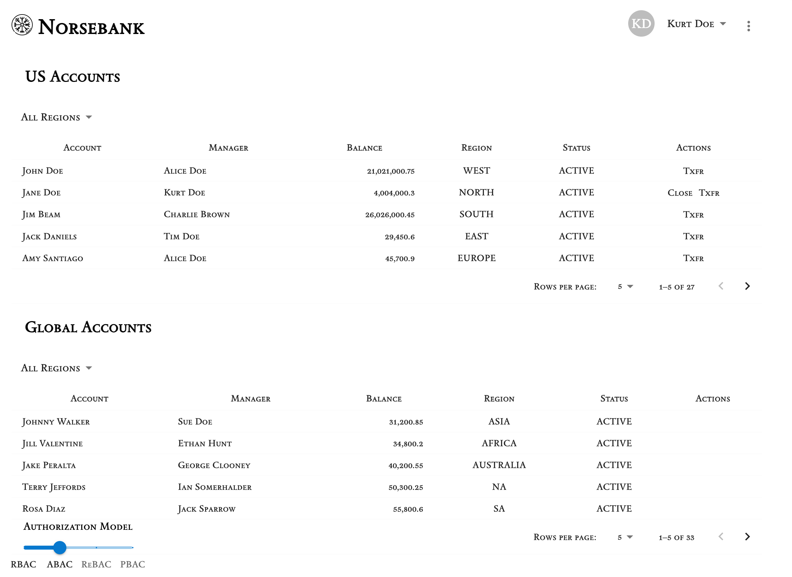

# Norsebank Accounts Demo App

This repository contains the Norsebank Accounts Demo application, which includes both backend and frontend components. The backend is written in Java and the frontend in JavaScript.

## Prerequisites
- An existing Kubernetes cluster with Istio enabled & [Gateway CRDs](https://gateway-api.sigs.k8s.io/guides/#getting-started-with-gateway-api) installed
- kubectl configured to interact with your Kubernetes cluster
- Terraform installed on your local machine
- A Styra DAS instance with an [API token](https://docs.styra.com/das/administration/token-management/create-api-token) created

## Setting Up a Local Minikube Cluster

If you don't have a Kubernetes cluster available, you can set up a local Minikube cluster:

### 1. Install Minikube
Follow the instructions to install Minikube from the [official documentation](https://minikube.sigs.k8s.io/docs/start/).

### 2. Start Minikube with Istio
```bash
minikube start --cpus=4 --memory=8192 --addons=istio,istio-provisioner
```

### 3. Verify Minikube Installation
```bash
kubectl get pods -n istio-system
```

## Setup Instructions

### 1. Clone the Repository
```bash
git clone https://github.com/kroekle/accounts-demo-app.git
cd accounts-demo-app
```

### 2. Configure Terraform
Navigate to the directory containing the Terraform scripts for setting up the demo app.

### 3. Initialize and Apply Terraform Scripts
```bash
cd terraform
terraform init
terraform apply
```
Make sure to provide the required variables (these can be set in a terraform.tfvars file).

  * bearer_token (DAS API token)
  * server_url (DAS tentant url e.g. https://TENANT.styra.com)
  * kube_config (default: ~/.kube/config)
  * kube_context (default: default)
  * eopa_license_key
  * application_host (default: accounts.norsebank.com)

### 4. Verify Deployment
Use the following command to verify that the services are running in your Kubernetes cluster:
```bash
kubectl get pods -n accounts-demo
```

There should also be two new Systems and one new Stack in your DAS tenant.
   * Norsebank US Accounts (system)
   * Norsebank Global Accounts (System)
   * Norsebank All Accounts (Stack)

### 5. Using the app
Ingressing to the application will be dependant on how your cluster is setup.  A working UI will look like the the following:



#### Ingressing with minikube
If you are using minikube the following step should work for you (tested on an Intel Mac)
Get the gateway ip address

bash```
kubectl get gateways.gateway.networking.k8s.io gateway -n accounts-demo -ojsonpath='{.status.addresses[0].value}'
```

Add this to your hosts file with the host name provided for the app (the default is accounts.norsebank.com)

bash```
127.0.0.1       accounts.norsebank.com
```
Start the minikube tunnel (in my experience each time you destroy/create the entire terraform script the tunnel needs to be restarted)

bash```
minikube tunnel
```
Now you should be able to go to the host in your browser (and curl the endpoints)

## Additional Information
For more information, refer to the individual README files in the `accounts-service` and `accounts-ui` directories.
